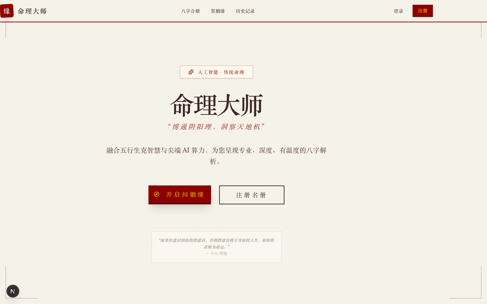
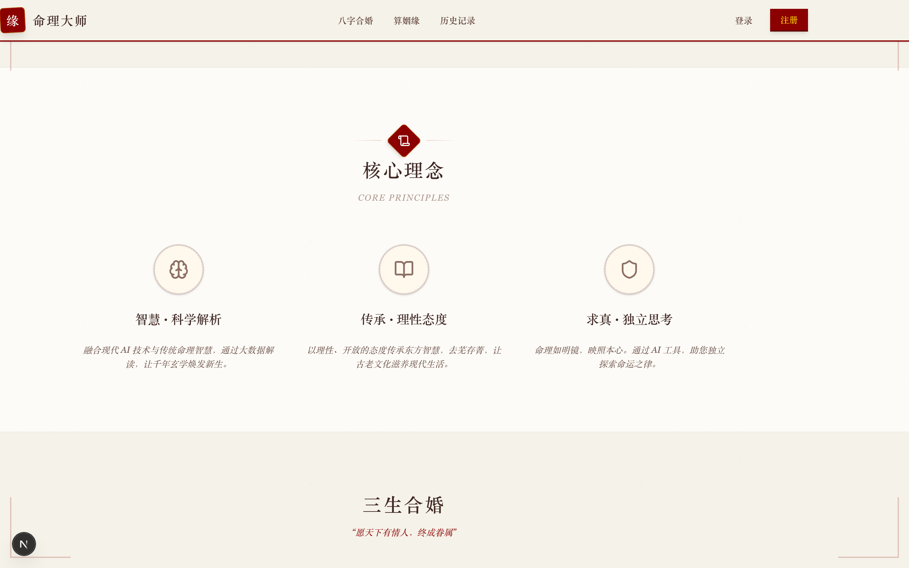
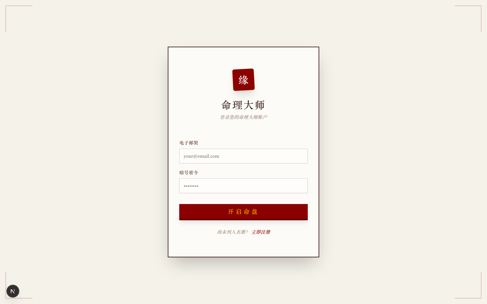
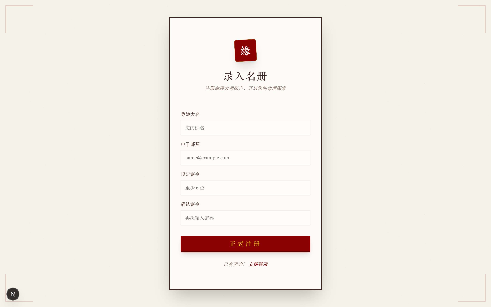

<div align="center">

# 命理大师 (FastMaster)

### 博通阴阳理，洞察天地机

融合传统八字命理智慧与现代 AI 技术的智能分析系统

[](https://nextjs.org/)
[](https://react.dev/)
[](https://www.typescriptlang.org/)
[](https://www.deepseek.com/)
[](https://tailwindcss.com/)
[](LICENSE)

[功能介绍](#功能介绍) · [界面预览](#界面预览) · [快速开始](#快速开始) · [技术架构](#技术架构) · [项目结构](#项目结构)

</div>

---

## 界面预览

<table>
<tr>
<td width="50%">

**首页 — 古典中国风设计**



</td>
<td width="50%">

**核心理念 — 智慧 · 传承 · 求真**



</td>
</tr>
<tr>
<td width="50%">

**登录 — 开启命盘**



</td>
<td width="50%">

**注册 — 录入名册**



</td>
</tr>
</table>

## 功能介绍

### 三生合婚 — 八字合婚分析

输入男女双方出生日期与时辰，系统自动排出八字四柱（年柱、月柱、日柱、时柱），由 AI 命理大师从五行互补、性格匹配、婚姻宫、家庭、子嗣等多维度进行深度解析，生成 0-100 分的契合度评分与详细分析报告。

### 算姻缘 — 个人姻缘分析

根据个人八字信息，AI 分析桃花运势特点与旺盛时期，描绘最适合的另一半特质与性格，提供近年流年姻缘运势走向分析。

### AI 追问对话

针对分析结果，支持与 AI 命理大师进行多轮对话，深入解答命理相关疑问，助您拨云见日。

### 历史记录

所有分析记录自动保存，随时回顾历史命盘，追溯过往解析。

## 技术架构

```
┌─────────────────────────────────────────────────────────┐
│                      客户端 (Browser)                     │
│               Next.js 16 / React 19 / SSR                │
│           Tailwind CSS 4 · Radix UI · Recharts           │
└──────────────────────┬──────────────────────────────────┘
                       │ HTTPS
┌──────────────────────▼──────────────────────────────────┐
│                    Next.js API Routes                    │
│  ┌──────────┐  ┌──────────┐  ┌────────────────────────┐ │
│  │ Auth API │  │ Bazi API │  │    AI Analysis API     │ │
│  │(NextAuth)│  │(Marriage/ │  │  (Destiny/Chat/Review) │ │
│  │          │  │ Destiny)  │  │                        │ │
│  └────┬─────┘  └────┬─────┘  └──────────┬─────────────┘ │
│       │              │                   │               │
│  ┌────▼──────────────▼───┐  ┌────────────▼─────────────┐ │
│  │   Prisma ORM (SQLite) │  │  命理大师 Agent (DeepSeek)│ │
│  │   用户 · 分析 · 对话   │  │  知识库 · 润色 · 追问    │ │
│  └───────────────────────┘  └──────────────────────────┘ │
└─────────────────────────────────────────────────────────┘
```

### 核心技术栈

| 层级 | 技术 | 说明 |
|------|------|------|
| **前端框架** | Next.js 16 / React 19 | App Router + Server Components |
| **语言** | TypeScript 5 | 全栈类型安全 |
| **样式** | Tailwind CSS 4 / Radix UI | 古典中国风主题 + 无障碍组件 |
| **数据库** | SQLite + Prisma ORM | 轻量持久化，零配置部署 |
| **认证** | NextAuth.js | 邮箱密码登录，可扩展 OAuth |
| **AI 引擎** | DeepSeek API (OpenAI SDK) | 命理大师 Agent + 异步润色 |
| **八字算法** | lunar-typescript | 农历转换 · 八字排盘 · 干支计算 |
| **图表** | Recharts | 五行属性可视化 |
| **表单** | React Hook Form + Zod | 类型安全的表单验证 |
| **Markdown** | react-markdown + remark-gfm | AI 分析结果渲染 |

### AI 架构设计

```
用户提交八字信息
       │
       ▼
┌──────────────┐     ┌──────────────────┐
│ 八字排盘计算  │────▶│ 命理大师 Agent    │
│ (lunar-ts)   │     │ 融合经典知识库     │
└──────────────┘     │ 生成专业分析报告   │
                     └───────┬──────────┘
                             │ 立即返回原始分析
                             ▼
                     ┌──────────────────┐
                     │ 后台异步润色      │
                     │ (DeepSeek Review) │
                     │ 更新数据库        │
                     └──────────────────┘
```

- **命理大师 Agent** — 基于经典命理典籍（《滴天髓》《子平真诠》《穷通宝鉴》等）训练的专业分析人格，输出纯文字古典风格报告
- **异步润色机制** — 分析结果即时返回，润色在后台完成，用户无需等待
- **知识库** — 精炼的命理知识速查文件，覆盖五行生克、十神论命、神煞速查等核心理论

## 项目结构

```
fastmaster/
├── prisma/                         # 数据库
│   ├── schema.prisma               # 数据模型 (User / Analysis / Conversation)
│   ├── seed.ts                     # 种子数据
│   └── migrations/                 # 迁移文件
├── public/
│   └── screenshots/                # README 截图
├── src/
│   ├── app/
│   │   ├── (auth)/                 # 认证路由组
│   │   │   ├── login/              # 登录页
│   │   │   └── register/           # 注册页
│   │   ├── (main)/                 # 主站路由组
│   │   │   ├── page.tsx            # 首页（古典中国风 Landing）
│   │   │   └── workspace/          # 命理工作台
│   │   │       ├── bazi-marriage/  # 八字合婚分析 + 详情
│   │   │       ├── bazi-destiny/   # 算姻缘分析 + 详情
│   │   │       └── history/        # 历史记录
│   │   ├── api/                    # API 路由
│   │   │   ├── auth/               # NextAuth + 注册
│   │   │   └── bazi/               # 合婚 / 姻缘 / 追问 API
│   │   └── layout.tsx              # 根布局
│   ├── components/
│   │   ├── layout/                 # Header · Footer · Sidebar
│   │   ├── providers/              # Session / Theme Provider
│   │   └── ui/                     # Radix UI 组件库
│   ├── lib/
│   │   ├── ai/                     # AI 核心
│   │   │   ├── agent.ts            # DeepSeek 客户端 + 分析/润色/追问
│   │   │   ├── prompts.ts          # 命理大师人格 + 系统提示词
│   │   │   └── knowledge/          # 命理知识库文件
│   │   ├── bazi/                   # 八字排盘核心算法
│   │   ├── auth.ts                 # NextAuth 配置
│   │   └── prisma.ts               # Prisma 客户端
│   └── types/                      # TypeScript 类型定义
├── next.config.ts
├── package.json
└── tsconfig.json
```

## 快速开始

### 环境要求

- **Node.js** 18+
- **npm** / yarn / pnpm
- **DeepSeek API Key** — [申请地址](https://platform.deepseek.com/)

### 1. 克隆仓库

```bash
git clone https://github.com/kidcrazequ/FastMaster.git
cd FastMaster
```

### 2. 安装依赖

```bash
npm install
```

### 3. 配置环境变量

```bash
cp .env.example .env.local
```

编辑 `.env.local` 填入以下配置：

```env
# 数据库（SQLite，开箱即用）
DATABASE_URL="file:./dev.db"

# NextAuth 认证
NEXTAUTH_SECRET="your-secret-key"        # 随机字符串，可用 openssl rand -base64 32 生成
NEXTAUTH_URL="http://localhost:3000"

# DeepSeek AI API
DEEPSEEK_API_KEY="your-deepseek-api-key"
DEEPSEEK_BASE_URL="https://api.deepseek.com"
```

### 4. 初始化数据库

```bash
npx prisma migrate dev --name init
npx prisma db seed
```

### 5. 启动开发服务器

```bash
npm run dev
```

访问 **http://localhost:3000** 开始使用。

## 环境变量参考

| 变量 | 必需 | 默认值 | 说明 |
|------|:----:|--------|------|
| `DATABASE_URL` | Yes | — | SQLite 数据库路径 |
| `NEXTAUTH_SECRET` | Yes | — | NextAuth 加密密钥 |
| `NEXTAUTH_URL` | Yes | — | 应用访问地址 |
| `DEEPSEEK_API_KEY` | Yes | — | DeepSeek API 密钥 |
| `DEEPSEEK_BASE_URL` | No | `https://api.deepseek.com` | DeepSeek API 地址 |
| `SKIP_REVIEW` | No | `false` | 跳过 AI 润色步骤（开发调试用） |
| `REVIEW_MODEL` | No | — | 润色使用的模型名称 |

## 数据模型

```
User ──────────┬──── MarriageAnalysis ──── Conversation
               │         (合婚分析)         (追问对话)
               │
               └──── DestinyAnalysis ──── DestinyConversation
                       (姻缘分析)           (追问对话)
```

- **User** — 用户信息，支持高级用户标识
- **MarriageAnalysis** — 合婚分析（双方八字、分析结果、契合度评分）
- **DestinyAnalysis** — 姻缘分析（个人八字、分析结果）
- **Conversation / DestinyConversation** — AI 追问对话历史

## 设计风格

采用**古典中国风**设计语言，营造传统命理文化的沉浸式体验：

| 元素 | 配色 | 用途 |
|------|------|------|
| 暗红 | `#8B0000` | 主色调 · 按钮 · 标题 |
| 金色 | `#FFD700` | 点缀 · 边框 · 高亮 |
| 古纸 | `#F5F2E9` | 背景底色 |
| 深棕 | `#3E2723` | 正文文字 |

- 衬线字体（Serif）贯穿全站
- 古纸纹理背景 + 传统装饰边框
- AI 输出纯文字，禁用 emoji，保持古典文风

## 作者

**zhi.qu** — 2026

## 许可证

本项目基于 [MIT 许可证](LICENSE) 开源，仅供学习交流使用。

---

<div align="center">

**命理大师** — 融合五行生克智慧与 AI 算力，为您呈现专业、深度、有温度的八字解析。

</div>
